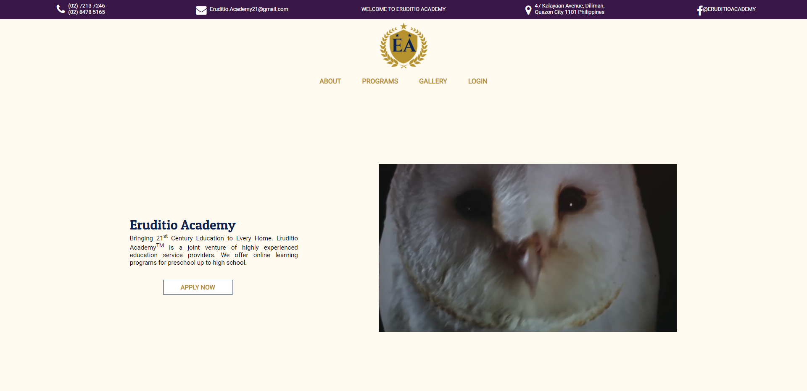
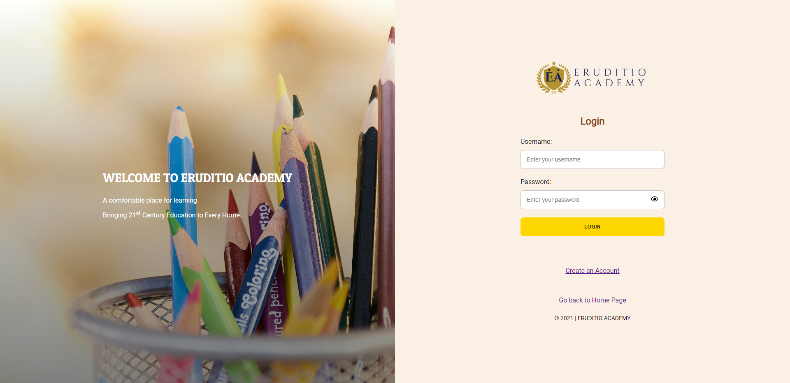
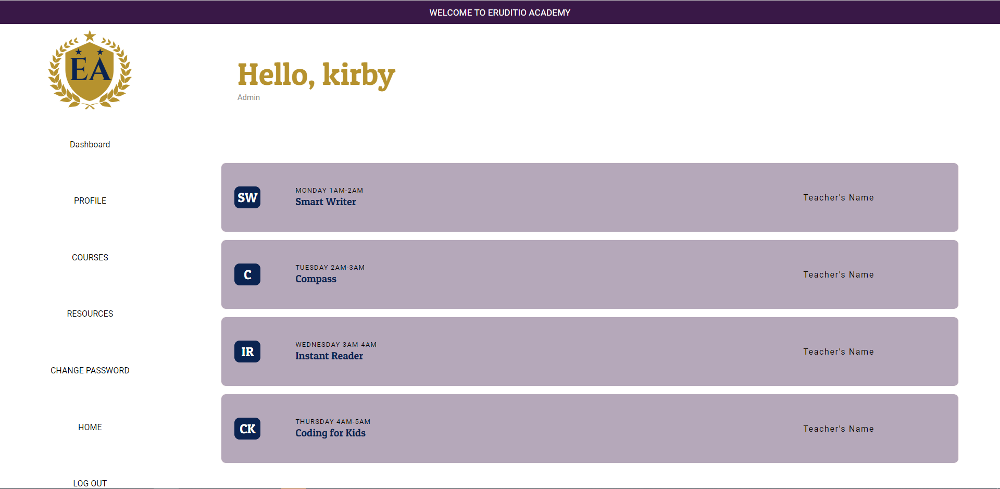
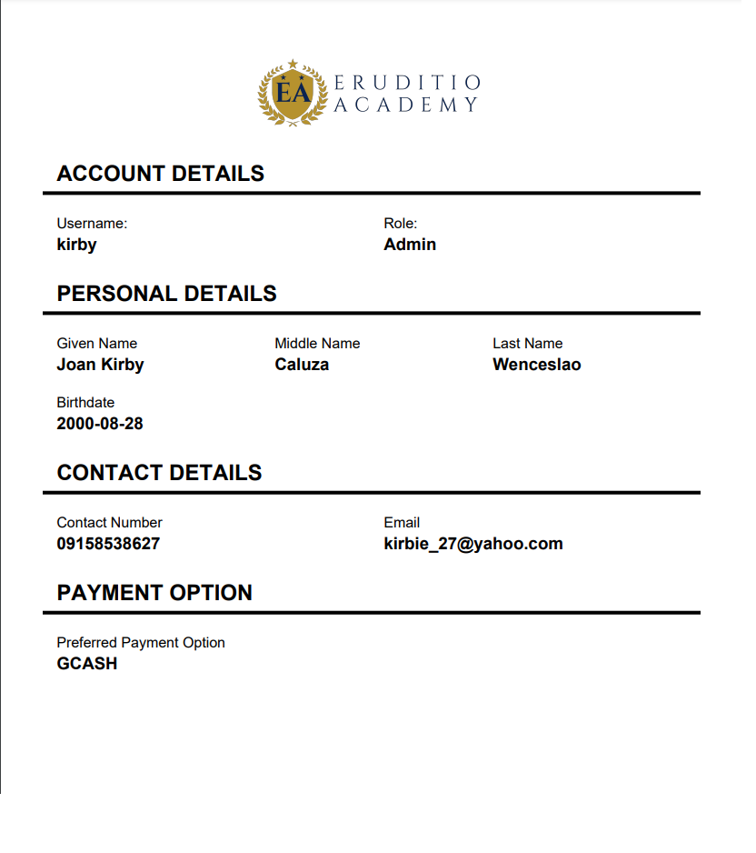

# eruditio_academy
A web application created using java which was done as a project for the completion of the subject ICS2609 - APPLICATIONS DEVELOPMENT AND EMERGING TECHNOLOGIES 2 (ENTERPRISE-BACK-END)

#Sample Snippets of the runtime of the Application

## Landing Page

## Log In Page

## Dashboard

## Report Generated

